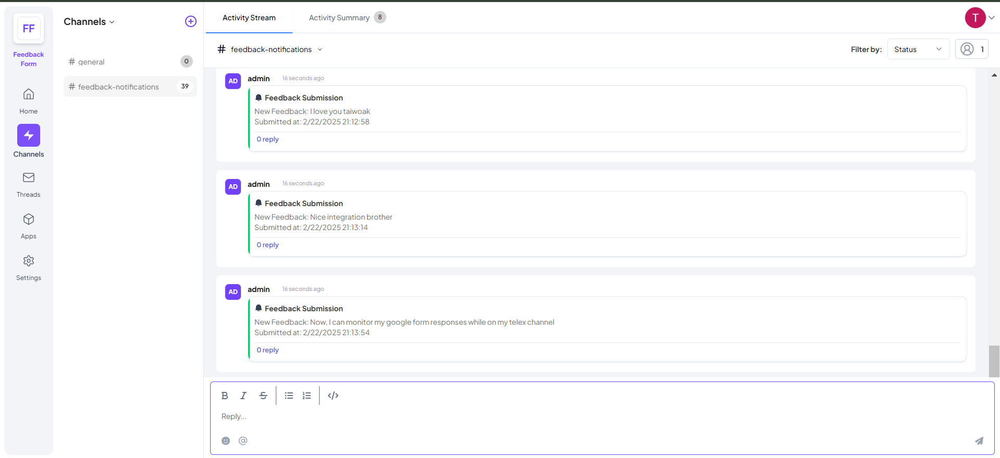

# Feedback Form Monitoring Integration

This integration tracks customer feedback form submissions from Google Forms and automatically sends notifications to a specified Telex channel.

## Features
- Fetches form responses from a Google Sheets backend.
- Processes feedback submissions in real time.
- Sends notifications to Telex for monitoring.
- Supports manual and automated data processing.

## Prerequisites
Ensure you have the following before setting up the integration:
- Node.js installed on your machine.
- A Google Sheet linked to a Google Form for storing responses.
- A Telex webhook URL for sending notifications.
- API credentials for Google Sheets.

## Setup Instructions
1. **Clone the repository:**
   ```sh
   git clone https://github.com/telexintegrations/telex-feedback-integration.git
   cd telex-feedback-integration
   ```

2. **Install dependencies:**
   ```sh
   npm install
   ```

3. **Create a `.env` file** in the project root and add the following:
   ```env
   PORT=3000
   SHEET_ID=your_google_sheet_id
   GOOGLE_API_KEY=your_google_api_key
   TELEX_WEBHOOK=your_telex_webhook_url
   ```

4. **Run the integration:**
   ```sh
   node index.js
   ```

## API Endpoints
### Fetch Feedback Data
**GET `/api/telex/data`**
- Retrieves feedback responses from Google Sheets.
- **Response:**
  ```json
  {
    "data": [
      {
        "timestamp": "2025-02-22",
        "feedback": "Great service!"
      }
    ]
  }
  ```

### Process Feedback Manually
**POST `/api/telex/tick`**
- Manually triggers processing and sends feedback data to Telex.
- **Response:**
  ```json
  {
    "message": "Tick received, feedback processed!"
  }
  ```

## Automated Processing
- The integration fetches new responses from Google Sheets every 60 seconds and sends them to Telex automatically.

## Testing
Run tests using Jest:
```sh
npm test
```

### Test Cases
- Verify that form responses are correctly retrieved from Google Sheets.
- Ensure feedback messages are successfully sent to Telex.
- Confirm API endpoints return the expected responses.

## Screenshots
Example notification received in the Telex channel:


## Quick Test
- Fill a feedback form [here](https://forms.gle/LRWZU2VegVwiXWcF9)
- Confirm your response(s) [here](https://docs.google.com/spreadsheets/d/1d6tldVy6N-i5EwHtlkxvc5yxG1HN3S84no0bFH-wdzw/edit?usp=sharing) OR on postman by copying this URL: https://telex-feedback-integration.onrender.com/api/telex/data
- The application will send new data to the Telex channel at the interval of 60 seconds OR you can manually initiate on Postman with this URL: https://telex-feedback-integration.onrender.com/api/telex/tick
- Check the Test channel for notifications

## License
This project is open-source and available under the MIT License.

## Contributions
Feel free to open issues or submit pull requests for improvements!
